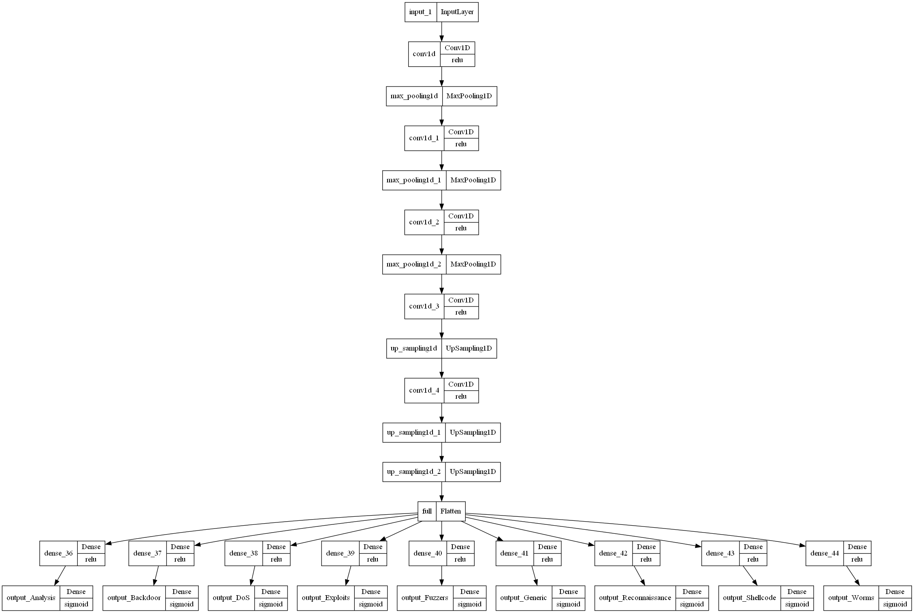
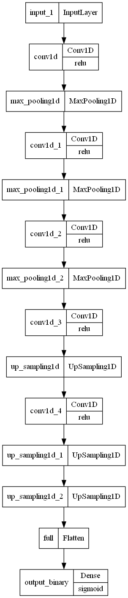

# An Autoencoder-based Multi-task Learning for Intrusion Detection in IoT Networks
 
Conference paper presented at https://usbereit.ieeesiberia.org/
 
**Abstract** The size of Internet of Things (IoT) networks, the physical devices connected to them, and the volume of data processed have grown exponentially over the past decade. Meanwhile, the confidentiality of data processed by IoT and vulnerabilities of intra-network devices also make security the most crucial issue. While many deep learning-based intrusion detection techniques have been proven to be successful, most of research papers in this area focus on single task learning. We propose a novel Multi-task Learning (MTL)-based approach for multi-class IoT network classification. An Autoencoder-based MTL model is applied for the multi-class attack detection, utilizing Stochastic Weight Averaging algorithm to boost model performance. Comparisons of the proposed approach with single task learning (STL) models and the existing MTL model are conducted, and the results prove it has better capability to detect rare intrusions with limited samples, than STL models like DNN, CNN, RNN and LSTM, and the existing MTL model.
 
*Model structure:*
 
Visulization of MTL Model Structure
 

 
Visulization of Base Model Structure
 

